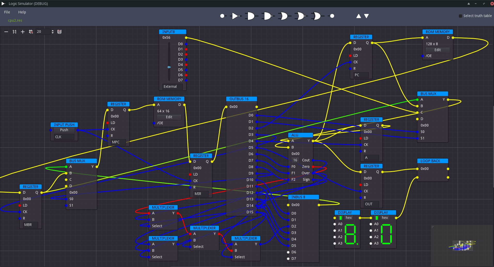

# Logic Simulator 2
A refactored version of [Logic Simulator](https://github.com/andrew-wilkes/logic-simulator).

The original worked ok but the code became a bit unmanageable as the project evolved, so now there is a chance to re-create it based on experience gained.

## Testing

Some of the code that is logic-intensive is unit tested.

To run the tests, install the AddOn for GdUnit4 in the Godot Editor asset library tab and you will likely be propted to then update to the latest version of it.

To learn about testing with this AddOn head over to: https://mikeschulze.github.io/gdUnit4/

The test suite scripts are in the src/tests/ directory.

## Links

[Nand to Tetris](https://www.nand2tetris.org/)